# 🕵️ grCyb3r — OhSINT
### TryHackMe | OSINT Investigation Write-Up

---

| Field | Details |
|---|---|
| **Platform** | TryHackMe |
| **Room** | [OhSINT](https://tryhackme.com/room/ohsint) |
| **Incident Reference** | grCyb3r-THM 002-2026-03 |
| **Date** | 12 March 2026 |
| **Prepared by** | Fabio Martines Laiola — SOC Investigation Portfolio |
| **Severity** | 🟡 Informational — OSINT & Digital Footprint Exposure |
| **Technique** | Open Source Intelligence (OSINT) |
| **Tools Used** | ExifTool, Google, Wigle.net, GitHub, WordPress, Twitter/X |
| **Status** | ✅ Completed — All 7 Questions Solved |

---

## 📋 Summary

As the name of the room suggests, this walkthrough explores **Open Source Intelligence (OSINT)** techniques by using publicly available data to analyze a provided image. The objective is to demonstrate how tracing a creator's digital footprint — starting from a single ordinary file — can lead to significant discoveries. This report covers seven investigative questions.

---

## 🔎 The Challenge

**Download:** `WindowsXP.jpg`


When I look at this image, I see nothing at first. No names, no dates, no clues. To someone without technical knowledge, this is just a picture. But to an investigator, it is a primary source full of hidden information. I accept the challenge — using Kali Linux and a VPN connection.

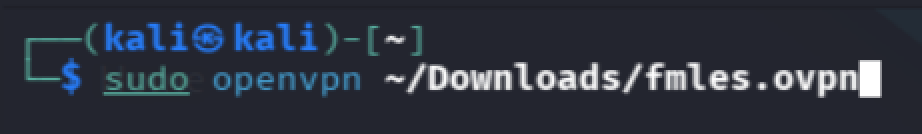

---

## 🛠️ Technical Findings

### Step 1 — Extract Metadata with ExifTool

The first question is: what can I do with the image? After checking the lab hint, I found **exiftool** — a tool to extract file metadata. This built the initial trail of the investigation.

```bash
exiftool WindowsXP.jpg
```

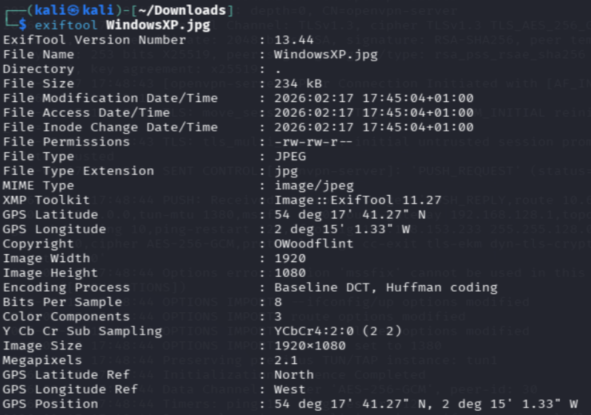

The field **Copyright: OWoodflint** immediately caught my attention. It looks like a username or nickname — and that's exactly what it is. The trail begins here.

---

### Step 2 — Google Search for Social Media Accounts

With the username `OWoodflint` in hand, I searched Google for associated social media accounts.

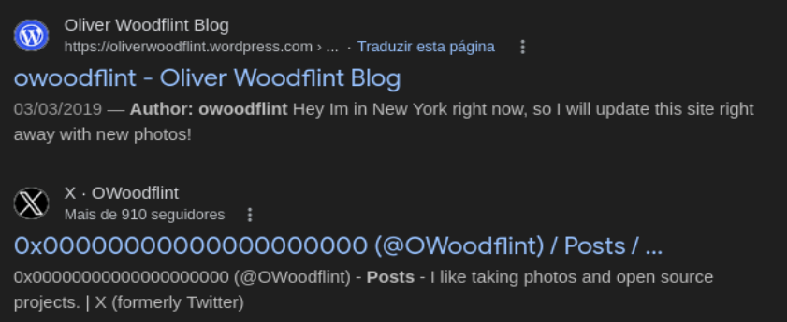

Two results stood out right away:

- 🐦 **Twitter/X:** `https://x.com/OWoodflint`
- 📝 **WordPress Blog:** `https://oliverwoodflint.wordpress.com/`

---

### Step 3 — Investigate Twitter Profile


The avatar is a **cat** — first question answered. The bio reads: *"I like taking photos and open source projects."* The mention of open source projects pointed me directly to GitHub.

---

#### ✅ Question 1 — What is the user's avatar of?
**Answer: `cat`**

---

### Step 4 — Investigate GitHub Profile

Searching GitHub for `OWoodflint` led me to:

`https://github.com/OWoodfl1nt`

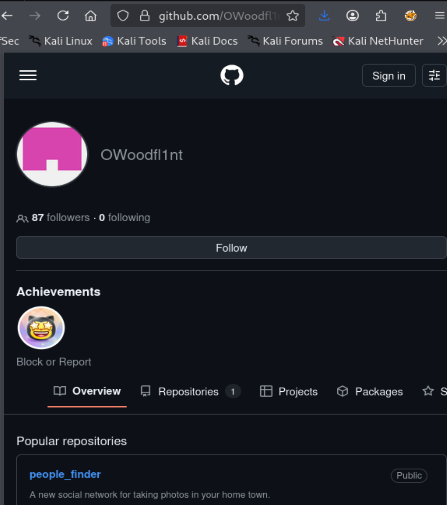

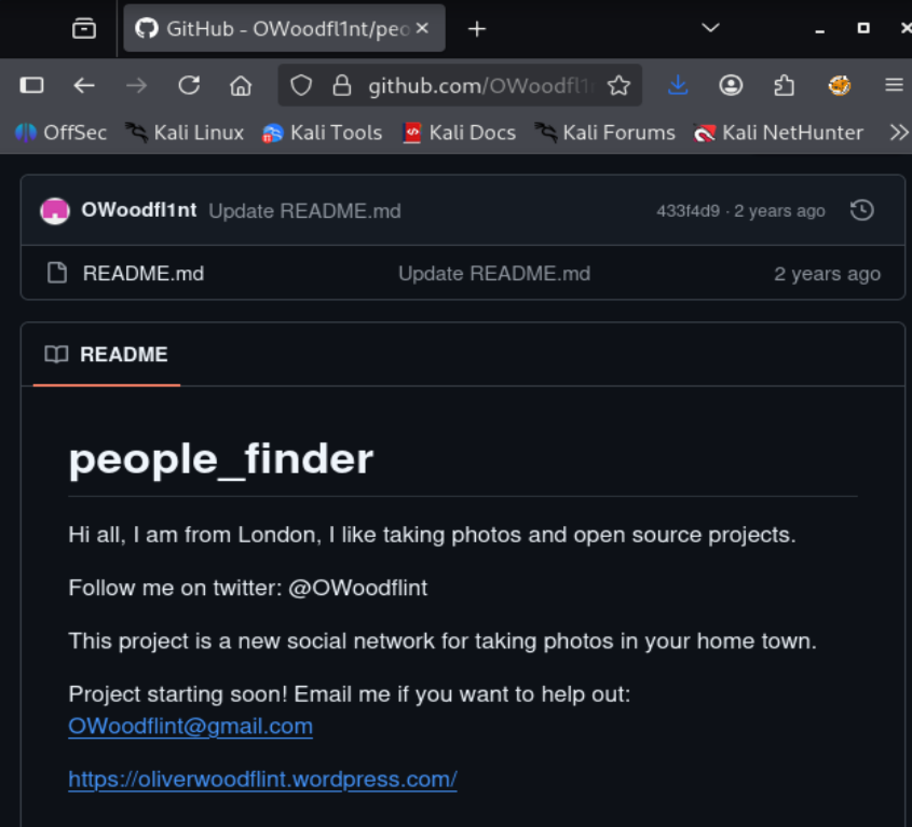

In the repository, he mentions being from **London** — and his email address `OWoodflint@gmail.com` is also exposed directly in the repository content.

---

#### ✅ Question 2 — What city is this person in?
**Answer: `London`**

#### ✅ Question 4 — What is his personal email address?
**Answer: `OWoodflint@gmail.com`**

#### ✅ Question 5 — What site did you find his email address on?
**Answer: `GitHub`**

---

### Step 5 — BSSID Lookup with Wigle.net

Back on Twitter, OWoodflint posted a tweet exposing his **BSSID: B4:5D:50:AA:86:41**.

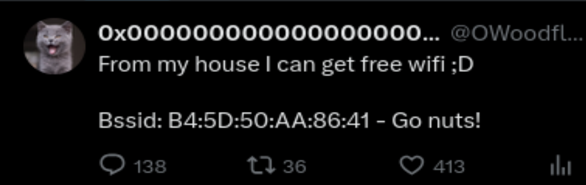

The lab hint suggested using **Wigle.net** to look up the BSSID. I created an account and used **View → Advanced Search** to query it.

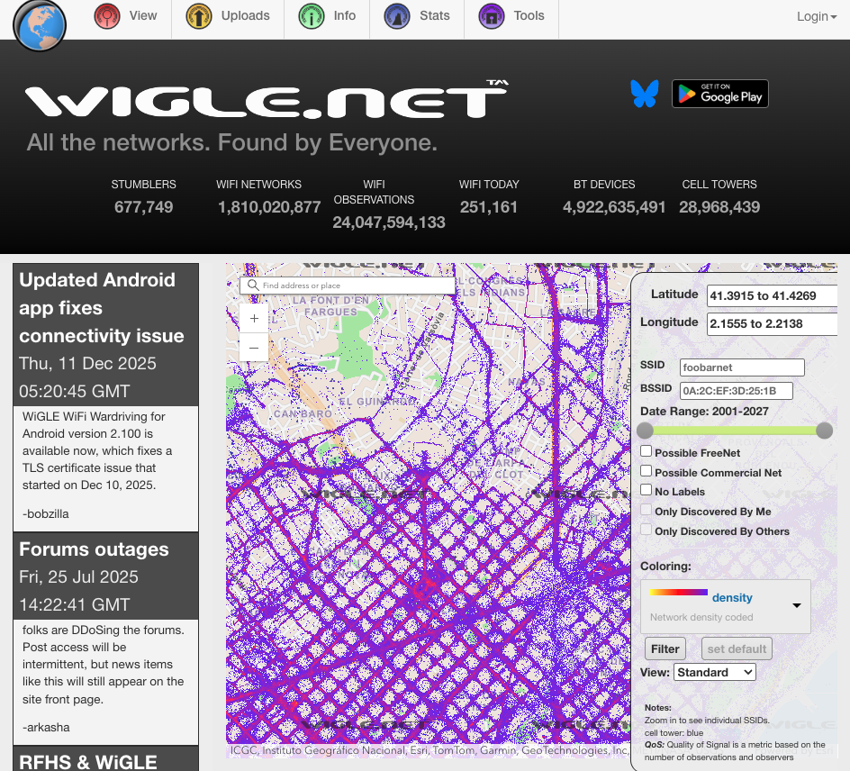

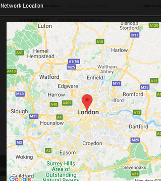

The location confirmed London — and also revealed the SSID of the wireless access point he connected to.

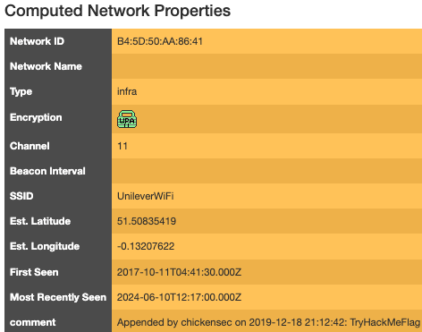

---

#### ✅ Question 3 — What is the SSID of the WAP he connected to?
**Answer: `UnileverWiFi`**

---

### Step 6 — Investigate the WordPress Blog

The blog at `https://oliverwoodflint.wordpress.com/` revealed his holiday destination.

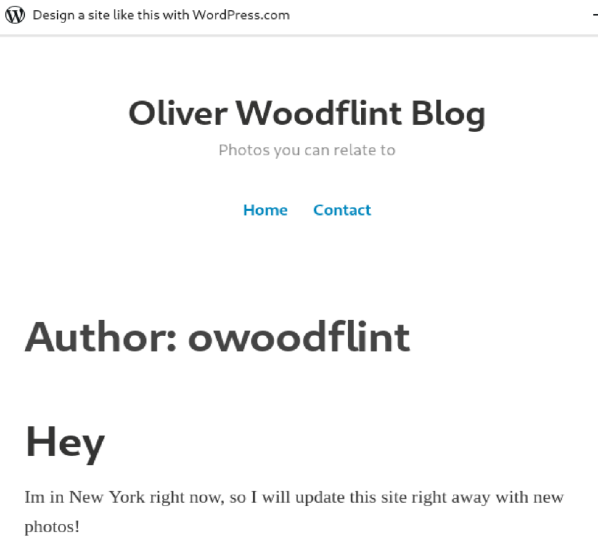

He mentions being in **New York** — question 6 answered.

---

#### ✅ Question 6 — Where has he gone on holiday?
**Answer: `New York`**

---

### Step 7 — Finding the Hidden Password (View Source)

This was the most challenging part. The password was not visible anywhere at first glance. I methodically checked each platform using **View Source**:

- ❌ Twitter — nothing suspicious
- ❌ GitHub — nothing suspicious
- ✅ **WordPress blog — something unusual**

In the page source, I found **white text on a white background** — invisible when viewing the site normally, but exposed in the raw HTML.

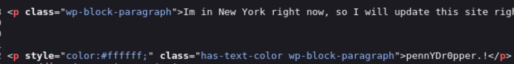

The isolated word **pennYDr0pper** stood out immediately — mixed case, contains a number, ends with special characters. All the hallmarks of a password.

Highlighting the blog text confirmed it:

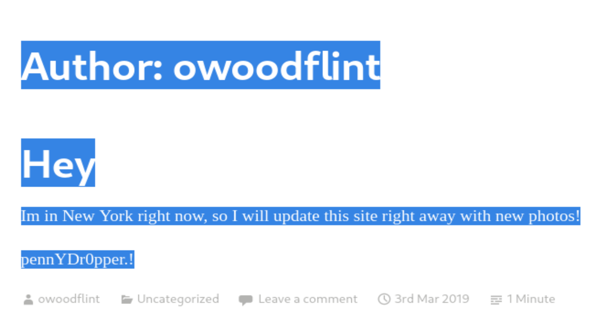

---

#### ✅ Question 7 — What is the person's password?
**Answer: `pennYDr0pper.!`**

---

## ✅ Answers Summary

| Question | Answer |
|---|---|
| What is the user's avatar of? | `cat` |
| What city is this person in? | `London` |
| What is the SSID of the WAP he connected to? | `UnileverWiFi` |
| What is his personal email address? | `OWoodflint@gmail.com` |
| What site did you find his email address on? | `GitHub` |
| Where has he gone on holiday? | `New York` |
| What is the person's password? | `pennYDr0pper.!` |

---

## 🔗 Digital Footprint — Attack Chain

```
1. Image file (WindowsXP.jpg) → ExifTool → Username: OWoodflint
2. Username → Google search → Twitter + WordPress + GitHub
3. Twitter → BSSID exposed → Wigle.net → SSID: UnileverWiFi
4. GitHub → City: London + Email: OWoodflint@gmail.com
5. WordPress → Holiday: New York
6. WordPress (View Source) → Hidden password: pennYDr0pper.!
```

---

## 🛡️ Key Takeaways

1. **Metadata is dangerous** — always strip EXIF data before sharing images publicly.
2. **Usernames are traceable** — using the same handle across platforms creates a full digital profile.
3. **Never expose BSSIDs publicly** — they can be used to geolocate you.
4. **Source code hides secrets** — hidden text is not secure; anyone can view page source.
5. **Email addresses in public repos** — GitHub repositories are indexed and searchable.

---

## 📎 Tools Used

| Tool | Purpose |
|---|---|
| `exiftool` | Extract image metadata |
| Google | Username OSINT search |
| Twitter/X | Social media investigation |
| GitHub | Open source profile & email |
| Wigle.net | BSSID geolocation lookup |
| WordPress | Blog investigation |
| View Source | Hidden content discovery |

---

*grCyb3r | Fabio Martines Laiola*
*SOC Investigation Portfolio | TryHackMe Write-Up Series*
